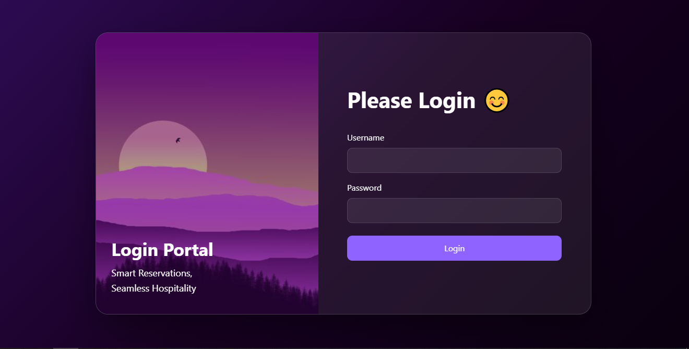
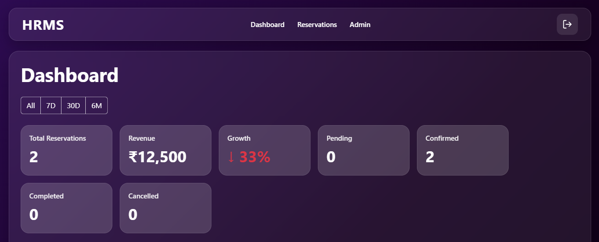
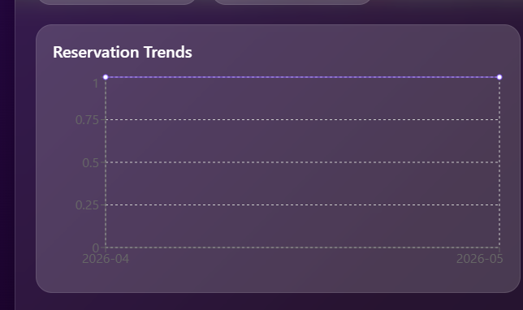
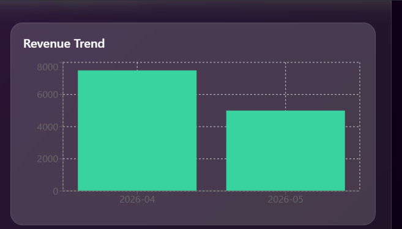

# 🚀 HRMS – Hotel Reservation Management System (Full-Stack)

A **production-ready full-stack Hotel Reservation Management System (HRMS)** built using:

* **Frontend:** React
* **Backend:** Spring Boot
* **Database:** MySQL
* **Security:** JWT Authentication

This system goes beyond basic CRUD and implements **real-world hotel booking logic**, including dynamic pricing, lifecycle automation, and admin-controlled pricing rules.

---

# 📌 Project Overview

HRMS is a complete system for managing:

* Hotel reservations
* Users and roles
* Admin operations
* Pricing strategies
* Booking lifecycle automation

---

# 🏗 Full-Stack Architecture

```

React Frontend
│
▼
Axios (API Layer)
│
▼
Spring Boot Backend
│
▼
MySQL Database

```

---

# 🔐 Authentication & Security

* JWT-based authentication
* Role-Based Access Control (ADMIN / MANAGER / STAFF)
* Protected frontend routes
* BCrypt password encryption
* Method-level security

---

# 🛎 Reservation Management

* Create reservation
* Update reservation
* Cancel reservation
* Pagination support

### Business Rules

* Check-in < Check-out
* Prevent overlapping bookings (double booking protection)
* Reservation tied to authenticated user

---

# 🔄 Booking Lifecycle (Enterprise Feature)

Reservation states:

```

PENDING → CONFIRMED → COMPLETED
↘ CANCELLED

```

### Automation

* Reservations automatically move to **COMPLETED** after checkout date
* Implemented using scheduled backend jobs

---

# 💰 Dynamic Pricing Engine

Pricing is calculated **per day**, not static.

### Pricing Rules

| Condition        | Pricing Logic        |
|----------------|--------------------|
| Weekday        | Base price          |
| Weekend        | +20% surge          |
| Festival       | Custom multiplier   |

### Key Points

* Festival pricing overrides weekend pricing
* Null-safe fallback (no crashes if pricing missing)
* Fully extendable for demand-based pricing

---

# ⚙️ Admin Panel

Admin capabilities:

* User management
* Role updates
* Pricing management (CRUD)
* Secure endpoints (ADMIN only)

---

# 💸 Pricing Management (Admin Feature)

Admin can:

* Add special pricing
* Update multiplier
* Delete pricing rules

No code changes required → fully dynamic system

---

# 📊 Dashboard & Analytics

* KPI cards
* Reservation trends
* Revenue analytics
* Occupancy tracking

---

# ⚙ Backend Features

* REST API architecture
* JWT security
* Global exception handling
* Flyway migrations
* Swagger documentation
* Scheduled tasks (automation)

---

# 🗄 Database

* MySQL relational schema
* Tables:
  - Users
  - Reservations
  - Rooms
  - SpecialPricing

---

# 📅 API Highlights

### Authentication
```

POST /api/v1/auth/login
POST /api/v1/auth/refresh

```

### Reservations
```

GET /api/v1/reservations
POST /api/v1/reservations
PUT /api/v1/reservations/{id}
DELETE /api/v1/reservations/{id}

```

### Pricing (Admin)
```

GET /api/v1/admin/pricing
POST /api/v1/admin/pricing
PUT /api/v1/admin/pricing/{id}
DELETE /api/v1/admin/pricing/{id}

````

---

# ▶ Running the Project

## Backend
```bash
cd HRMS-Backend
mvn spring-boot:run
````

## Frontend

```bash
cd hrms-frontend
npm install
npm start
```

---

# 🌐 Application URLs

Frontend:

```
http://localhost:3000
```

Backend:

```
http://localhost:8080
```

Swagger:

```
http://localhost:8080/swagger-ui/index.html
```

---

# 📊 Monitoring

```
http://localhost:8080/actuator/health
```

---

# 📸 Screenshots

## 🔐 Login Page



---

## 📊 Dashboard



---

## 🛎 Reservations Module

### Reservation Table


### Create / Edit Reservation


---

## 👥 Admin Panel

### User Management


### Role Management


---

## 📈 Analytics Charts

### Reservation Trends



### Revenue Chart



### Occupancy Chart


---

# 🎯 System Capabilities

✔ Full-stack application
✔ Secure authentication system
✔ Role-based access control
✔ Dynamic pricing engine
✔ Booking lifecycle automation
✔ Double booking prevention
✔ Admin pricing control
✔ Production-ready UI

---

# 🔮 Future Enhancements

* AI-based pricing prediction
* Payment integration
* Email notifications
* Cloud deployment (AWS / Docker / Kubernetes)
* Calendar-based pricing UI

---

# 👨‍💻 Author
Developed by **Pranav Chamoli** and **Dhruv Maithani**
```
