# 🚀 HRMS – Hotel Reservation Management System (Full-Stack)

A **production-ready full-stack Hotel Reservation Management System (HRMS)** built using:

* **Frontend:** React
* **Backend:** Spring Boot
* **Database:** MySQL
* **Security:** JWT Authentication

This project demonstrates **enterprise-level architecture**, combining secure backend APIs with a modern, responsive frontend dashboard.

---

# 📌 Project Overview

HRMS is a complete system for managing:

* Hotel reservations (**public + admin booking flows**)
* Users and roles
* Dynamic pricing strategies
* Booking lifecycle automation
* Asynchronous notification system (**Email + SMS**)
* Online + Offline payment workflows
* Analytics dashboards

The system is designed with:

* Scalable architecture
* Secure authentication system
* Role-based access control
* Clean layered backend design
* Event-driven + async processing
* Real-time dashboard synchronization
* Interactive analytics dashboard

---

# 🏗 Full-Stack Architecture

```text
React Frontend (UI + Routing + Charts)
        │
        │ Axios (REST API Calls)
        ▼
Spring Boot Backend (Business Logic + Security)
        │
        ▼
MySQL Database
```

---

# 🔐 Authentication & Security

* JWT-based authentication
* Secure login system
* Protected routes (frontend)
* Role-Based Access Control (ADMIN / MANAGER / STAFF)
* Session handling with auto logout
* BCrypt password encryption
* Method-level security
* Secures admin booking operations

---

# 🛎 Reservation Management

Full reservation lifecycle management:

* Create reservation
* View reservations
* Update reservation
* Delete reservation
* Pagination support
* Live dashboard sync

### Booking Modes

## 🔹 Public Booking (Customer Flow)

* Search rooms by date
* View dynamic pricing
* Book without login
* Choose payment mode
* Prepaid booking flow
* Pay at hotel option
* Receive booking confirmation (Email + SMS)
* View booking via reference
* Cancel booking

## 🔹 Admin Booking (On-Prem Flow)

* Create reservation manually
* Edit reservation
* Cancel reservation
* Calendar-based booking visibility
* Pagination & dashboard management
* Front desk operations support

### Business Rules

* Check-in date must be before check-out date
* Prevent overlapping room bookings
* Reservation status transitions enforced
* Payment mode tracked per reservation

---

## 🛑 Availability Validation

* Prevents double booking
* Checks overlapping date ranges
* Returns conflict errors

Integrated in:

* Backend validation
* Frontend booking flow

👉 Critical production logic

---

# 🔄 Booking Lifecycle

Reservation states:

```text
PENDING → CONFIRMED → COMPLETED
        ↘ CANCELLED
```

### Automation

* Reservations automatically move to **COMPLETED** after checkout date
* Implemented using scheduled backend jobs

### Status Visibility

Reservation dashboard displays:

* PENDING
* CONFIRMED
* CANCELLED
* COMPLETED

---

# 💳 Payment Management

Supports multiple payment modes:

* PREPAID
* PAY_AT_HOTEL

### Public Payment Flow

* Razorpay payment gateway integration
* Secure prepaid checkout
* Booking confirmation after payment success

### Operational Benefit

Dashboard shows payment mode for each booking so staff can instantly know:

* Already paid online
* Payment pending at check-in

---

# 📧 Notification System

A **fault-tolerant, asynchronous notification system** ensures reliable communication.

### 🔁 Notification Flow

```text
Booking Created
     ↓
Async Notification Trigger
     ↓
Log Created (PENDING)
     ↓
Send Email / SMS
     ↓
SUCCESS / FAILED
     ↓
Retry Scheduler (FAILED → SUCCESS)
```

### 🔹 Features

* Email integration (SMTP – Gmail)
* SMS integration
* Async processing using `@Async`
* Multi-channel delivery

### 🔹 Logging System

* `NotificationLog` entity tracks:

  * type (EMAIL / SMS)
  * recipient
  * message
  * status
  * error_message
  * timestamp

### 🔹 Retry Mechanism

* Scheduler retries failed notifications
* Automatic recovery

### 🔹 Impact

* Reliable communication
* Scalable system
* Production-grade fault tolerance

---

# 👥 Admin Panel

Admin capabilities:

* View all users
* Create new users
* Update user roles
* View all reservations
* Track public + admin bookings
* Monitor payment modes
* Manage lifecycle statuses

---

## ⚙️ Pricing Management (Admin Feature)

* Add special pricing
* Update multiplier
* Delete pricing rules

---

# 📊 Dashboard & Analytics

* KPI cards
* Reservation trends
* Revenue analytics
* Occupancy analytics
* Live synced reservation records

---

## 📅 Calendar-Based Booking View

* Displays bookings per day
* Disables booked dates
* Room-based filtering

---

## 💸 Price Preview (User Feature)

* Preview total price
* Price per night + total
* Number of nights
* Powered by `/price-preview` API

---

# ⚙ Backend Features

* REST API architecture
* JWT authentication
* Global exception handling
* Flyway migrations
* Swagger docs
* Async processing (`@Async`)
* Scheduler jobs (retry + lifecycle)
* DTO mapping
* Frontend/backend sync fixes

---

## 💰 Dynamic Pricing Engine

* Weekday → Base
* Weekend → +20%
* Festival → Override
* Per-day pricing aggregation

---

# 🗄 Database

* MySQL

### Tables:

* Users
* Reservations
* Rooms
* SpecialPricing
* NotificationLog
* Payments
* Audit Logs
* Customers

---

## 🧩 Database Design

## ER Diagram


### Key Relationships

* One user can manage multiple reservations
* One customer can create multiple reservations
* One reservation maps to one room
* One reservation can have one payment record
* Pricing modules support room-based and date-based pricing

---

## 📈 Revenue Calculation Logic

Includes:

* CONFIRMED
* COMPLETED

Excludes:

* PENDING
* CANCELLED

---

# 🐳 DevOps & Tools

* Docker
* Swagger
* Actuator

---

## 🔁 Booking Flow

1. Create reservation
2. Select payment mode
3. Confirm booking
4. Notification sent
5. Stay completed automatically
6. Cancel if needed

---

# 📅 API Highlights

### Authentication

```text
POST /api/v1/auth/login
POST /api/v1/auth/refresh
```

### Reservations

```text
GET /api/v1/reservations
POST /api/v1/reservations
PUT /api/v1/reservations/{id}
DELETE /api/v1/reservations/{id}
```

### Pricing

```text
GET /api/v1/admin/pricing
```

### Price Preview

```text
GET /price-preview
```

### Payments

```text
POST /payment/create-order
POST /payment/verify
```

---

# ▶ Running the Project

```bash
mvn spring-boot:run
npm start
```

---

# 📸 Screenshots

## 🔐 Login Page


## 📊 Dashboard


## 👥 Admin Panel

### Active Users

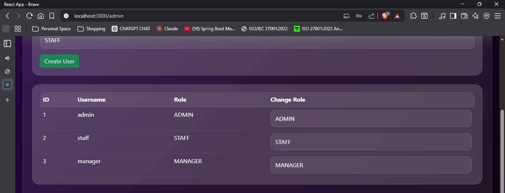

### User Creation

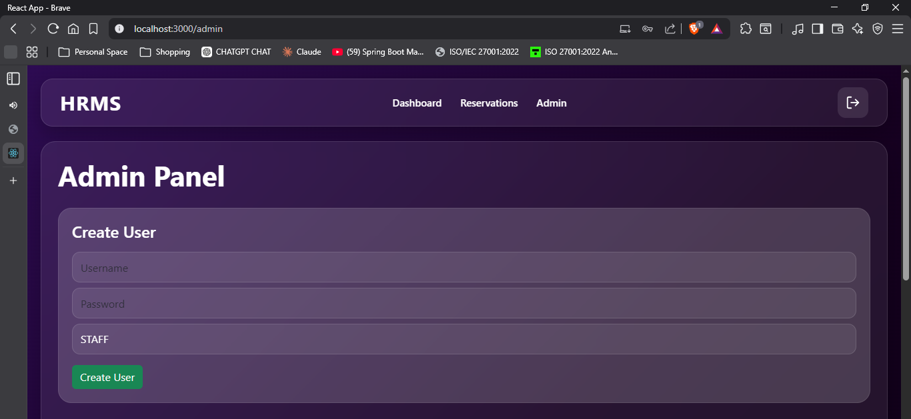

### Pricing Management

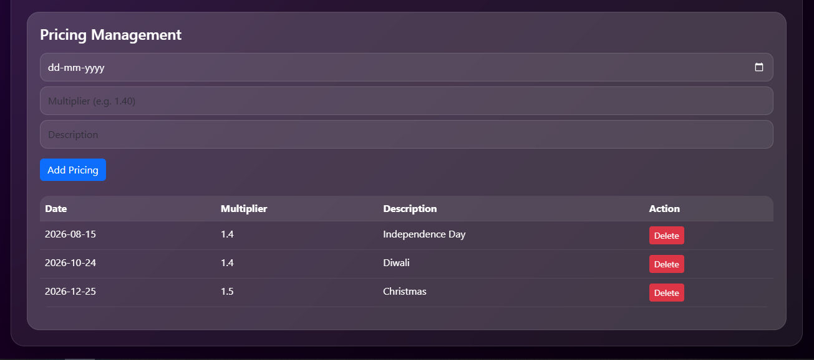

## 📈 Analytics Charts

### Reservation Trends


### Revenue Chart


### Occupancy Chart


---

## 🌐 Public Booking Module

### Public Booking Home

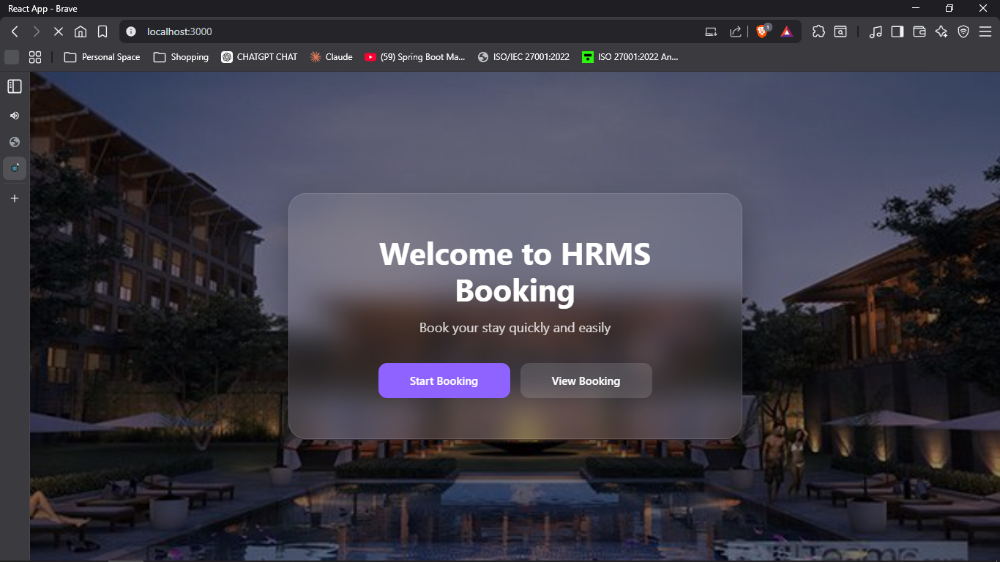

### Room Search

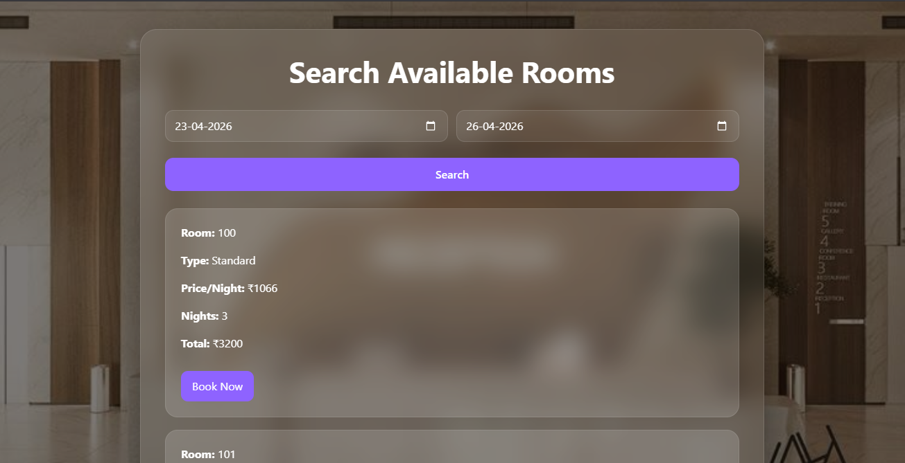

### Booking Page

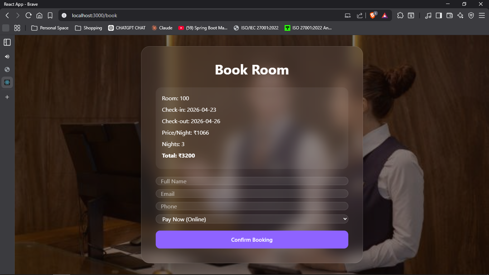

### Booking Confirmation

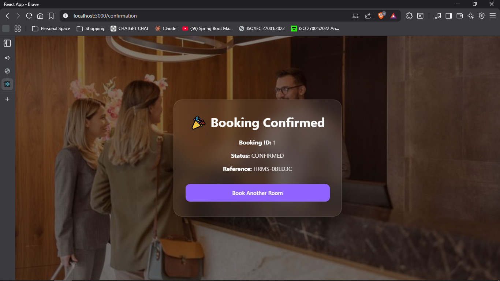

### View Booking

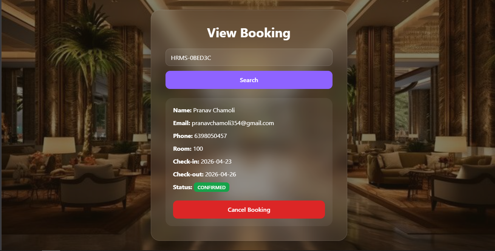

---

## 🏨 On-Premise Booking Module

### Reservations Table

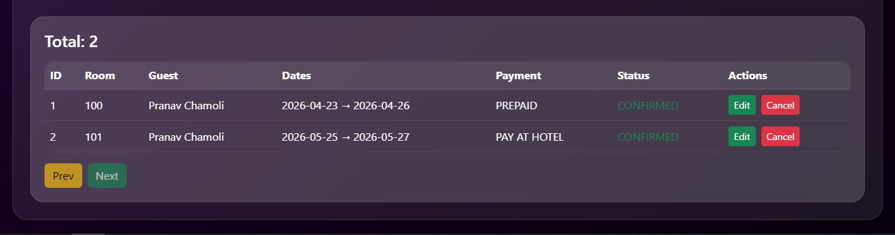

### Reservation Form

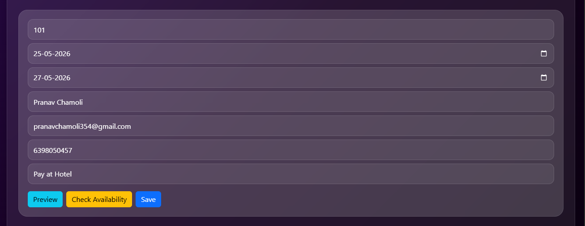

---

## 💳 Razorpay Payment Module

### Razorpay Checkout


### Payment Successful

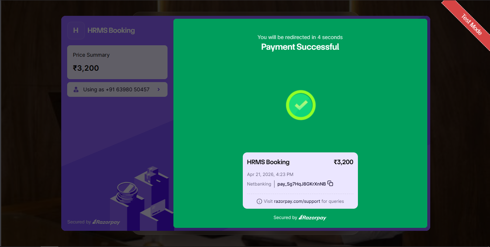

---

## 🎯 System Capabilities

* Full-stack application
* Secure authentication
* Role-based access
* Reservation lifecycle
* Dynamic pricing engine
* Public + Admin booking flows
* Razorpay payment integration
* Payment mode visibility
* Async notification system
* Retry + logging mechanism
* Calendar visualization
* Email + SMS integration
* Availability validation
* Live dashboard synchronization

---

## 🔐 Environment Variables

Before running the project, set:

```bash
DB_USERNAME=your_db_username
DB_PASSWORD=your_db_password
RAZORPAY_KEY=your_key
RAZORPAY_SECRET=your_secret
MAIL_USERNAME=your_email
MAIL_PASSWORD=your_password
```

### Windows

```bash
setx DB_USERNAME "root"
setx DB_PASSWORD "yourpassword"
```

### Mac/Linux

```bash
export DB_USERNAME=root
export DB_PASSWORD=yourpassword
```

---

# 👨‍💻 Author

Developed by **Pranav Chamoli**
