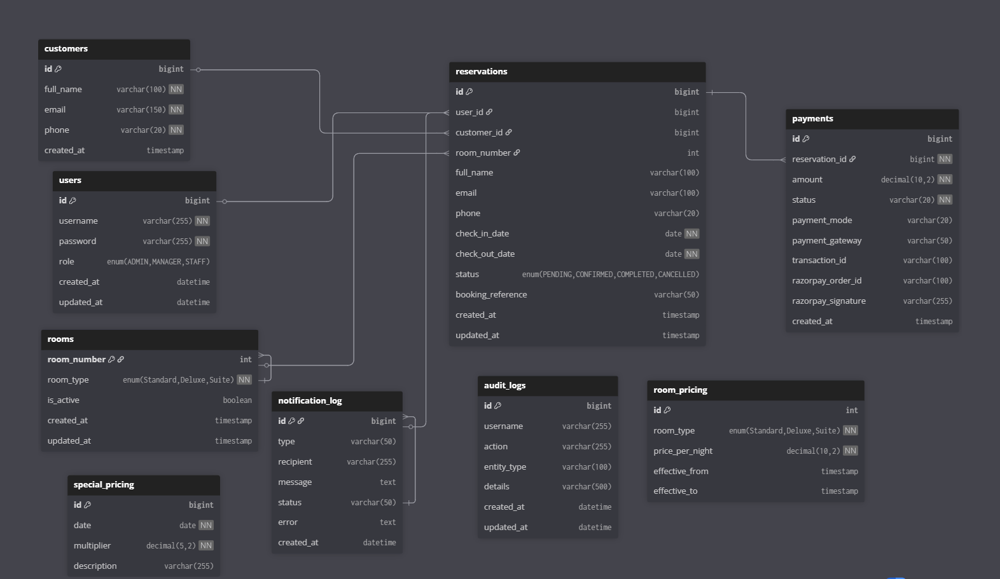

# 🚀 HRMS – Hotel Reservation Management System (Full-Stack)

A **production-ready full-stack Hotel Reservation Management System (HRMS)** built using:

* **Frontend:** React
* **Backend:** Spring Boot
* **Database:** MySQL
* **Security:** JWT Authentication

This project demonstrates **enterprise-level architecture**, combining secure backend APIs with a modern, responsive frontend dashboard.

---

# 📌 Project Overview

HRMS is a complete system for managing:

* Hotel reservations
* Users and roles
* Admin operations
* Analytics dashboards

The system is designed with:

* Scalable architecture
* Secure authentication system
* Role-based access control
* Clean layered backend design
* Interactive analytics dashboard

---

# 🏗 Full-Stack Architecture

```id="arch1"
React Frontend (UI + Routing + Charts)
        │
        │ Axios (REST API Calls)
        ▼
Spring Boot Backend (Business Logic + Security)
        │
        ▼
MySQL Database
```

---

# 📂 Project Structure

## 🔙 Backend (Spring Boot)

```id="backend-structure-final"
src/main/java/com/example/HRMS
│
├── config          # Security, JWT, CORS, Swagger configuration
├── controller      # REST API controllers
├── dto             # Request & response models
├── entity          # Database entities
├── exception       # Global exception handling
├── repository      # JPA repositories
├── service         # Business logic
│   ├── impl
│   └── ai
└── HRMSApplication
```

Resources:

```id="backend-resources-final"
src/main/resources
│
├── application.properties
├── db/migration
└── static
```

---

## 🎨 Frontend (React)

```id="frontend-structure-final"
hrms-frontend/src
│
├── api
├── components
├── layouts
├── pages
│   ├── LoginPage
│   ├── DashboardPage
│   ├── ReservationsPage
│   └── AdminPage
├── services
├── utils
├── App.js
└── index.js
```

---

## 🔗 Architecture Flow

```id="flow-final"
UI (React Pages)
   ↓
Service Layer
   ↓
Axios Client (JWT Interceptor)
   ↓
Spring Boot Controllers
   ↓
Service Layer
   ↓
Repository Layer
   ↓
MySQL Database
```

---

# 🔐 Authentication & Security

* JWT-based authentication
* Secure login system
* Protected routes (frontend)
* Role-Based Access Control (ADMIN / MANAGER / STAFF)
* Session handling with auto logout
* BCrypt password encryption
* Method-level security

---

# 🛎 Reservation Management

Full CRUD operations:

* Create reservation
* View reservations
* Update reservation
* Delete reservation
* Pagination support

### Business Rules

* Check-in date must be before check-out date
* Prevent overlapping room bookings
* Reservation status transitions enforced

---

# 🔄 Booking Lifecycle (Enterprise Feature)

Reservation states:

PENDING → CONFIRMED → COMPLETED  
        ↘ CANCELLED  

### Automation

- Reservations automatically move to **COMPLETED** after checkout date
- Implemented using scheduled backend jobs
- No manual intervention required

### Business Impact

- Accurate reservation tracking
- Real-world hotel workflow simulation
- Enables correct revenue calculation

---

# 👥 Admin Panel

Admin capabilities:

* View all users
* Create new users
* Update user roles
* Role-based UI restriction

---

## ⚙️ Pricing Management (Admin Feature)

Admin can:

- Add special pricing (festival / peak days)
- Update pricing multiplier
- Delete pricing rules

### Key Advantage

- No code changes required
- Fully dynamic pricing system

---

# 📊 Dashboard & Analytics

* KPI cards (Total reservations, Active bookings)
* Reservation trends (monthly)
* Revenue analytics
* Occupancy analytics

Built using:

* Recharts

---

## 💸 Price Preview (User Feature)

Before booking, users can:

- Preview total price
- See pricing impact based on selected dates
- Understand difference between base and final price

### Benefits

- Transparent pricing
- Better user experience
- Reduces booking confusion

---

# ⚙ Backend Features

* REST API architecture
* JWT authentication & authorization
* Global exception handling
* Analytics endpoints
* Flyway database migrations
* Swagger API documentation
* Spring Boot Actuator monitoring

---

## 💰 Dynamic Pricing Engine

Pricing is calculated **per day**, not static.

### Pricing Rules

- Weekdays → Base price
- Weekends → +20% surge
- Special/Festival pricing → Custom multiplier
- Festival pricing overrides weekend pricing

### Architecture

ReservationService → PricingService → SpecialPricingRepository

### Key Highlights

- Null-safe pricing (no crashes if data missing)
- Extendable for demand-based pricing
- Admin-controlled pricing via UI

---

# 🗄 Database

* MySQL
* Flyway migrations
* Relational schema (Users, Reservations, Rooms)

---

## 📈 Revenue Calculation Logic

Revenue includes only:

- CONFIRMED reservations
- COMPLETED reservations

Excluded:

- PENDING
- CANCELLED

### Why This Matters

- Ensures financial accuracy
- Matches real-world hotel revenue tracking

---

# 🐳 DevOps & Tools

* Docker & Docker Compose
* Swagger / OpenAPI
* Spring Boot Actuator

---

## 🔁 Booking Flow

1. User creates reservation → PENDING
2. (Future: payment integration) → CONFIRMED
3. After checkout → automatically COMPLETED
4. User/Admin can cancel → CANCELLED

---


# 📅 API Highlights

### Authentication

```id="api-auth"
POST /api/v1/auth/login
POST /api/v1/auth/refresh
```

---

### Reservations

```id="api-res"
GET /api/v1/reservations
POST /api/v1/reservations
PUT /api/v1/reservations/{id}
DELETE /api/v1/reservations/{id}
```

---

### Users (Admin)

```id="api-user"
GET /api/v1/users
POST /api/v1/users
PUT /api/v1/users/{id}/role
```

---

### Analytics

```id="api-analytics"
GET /api/v1/analytics/revenue
GET /api/v1/analytics/occupancy
GET /api/v1/analytics/monthly-revenue
GET /api/v1/analytics/cancellation-rate
```

### Pricing (Admin)

```id="api-pricing"
GET /api/v1/admin/pricing  
POST /api/v1/admin/pricing  
PUT /api/v1/admin/pricing/{id}  
DELETE /api/v1/admin/pricing/{id}
```

---

# ▶ Running the Project

## Backend

```bash id="run-backend"
cd HRMS-Backend
mvn clean install
mvn spring-boot:run
```

---

## Frontend

```bash id="run-frontend"
cd hrms-frontend
npm install
npm start
```

---

# 🌐 Application URLs

Frontend:

```id="url-frontend"
http://localhost:3000
```

Backend:

```id="url-backend"
http://localhost:8080
```

Swagger:

```id="url-swagger"
http://localhost:8080/swagger-ui/index.html
```

---

# 📊 Monitoring

Health check:

```id="monitor-health"
http://localhost:8080/actuator/health
```

---

# 🧠 AI Integration (Future Scope)

* Demand prediction
* Dynamic pricing
* Recommendation engine
* Predictive analytics

---

# 📈 Future Enhancements

* AI-based booking prediction
* Payment integration
* Email notifications
* Cloud deployment (AWS / Docker / Kubernetes)
* Microservices architecture

---

# 🗄 Database Design

## ER Diagram



---

## Key Relationships

- One user can have multiple reservations  
- One room can have multiple reservations  
- Each reservation belongs to one user and one room

---

# 📸 Screenshots

## 🔐 Login Page


---

## 📊 Dashboard


---

## 🛎 Reservations Module

### Reservation Table


### Create / Edit Reservation


---

## 👥 Admin Panel

### User Management


### Role Management


---

## 📈 Analytics Charts

### Reservation Trends


### Revenue Chart


### Occupancy Chart


---

## 🎯 System Capabilities

- Full-stack application  
- Secure authentication system  
- Role-based access control  
- Reservation management (CRUD + Pagination)  
- Analytics dashboard  
- Admin management system  
- Production-ready UI  
- Booking lifecycle automation  
- Dynamic pricing engine  
- Admin-controlled pricing rules  
- Price preview before booking  
- Revenue-safe calculation

---

## 🔐 Environment Variables

Before running the project, set:

DB_USERNAME=your_db_username  
DB_PASSWORD=your_db_password  

### Windows:

setx DB_USERNAME "root"
setx DB_PASSWORD "yourpassword"
---

# 👨‍💻 Author

Developed by **Pranav Chamoli**
